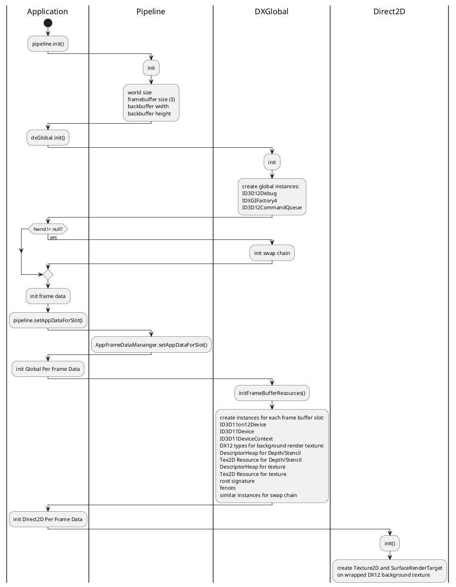

# Architecture (branch master2)

### Application and Framework Initialization

```plantuml
@startuml
|Application|
|Pipeline|
|DXGlobal|
|Direct2D|
    |Application|
    start
    :pipeline.init();
    |Pipeline|
    :init;
    :world size
    framebuffer size (3)
    backbuffer width
    backbuffer height;
    |Application|
    :dxGlobal.init();
    |DXGlobal|
    :init;
    :create global instances:
    ID3D12Debug
    IDXGIFactory4
    ID3D12CommandQueue;
    |Application|
    if (hwnd != null?) then (yes)
        |DXGlobal|
        :init swap chain;
    endif
    |Application|
    :init frame data;
    :pipeline.setAppDataForSlot();
    |Pipeline|
    :AppFrameDataMananger.setAppDataForSlot();
    |Application|
    :init Global Per Frame Data;
    |DXGlobal|
    :initFrameBufferResources();
    :create instances for each frame buffer slot:
    ID3D11on12Device
    ID3D11Device
    ID3D11DeviceContext
    DX12 types for background render texture:
    DescriptorHeap for Depth/Stencil
    Tex2D Resource for Depth/Stencil
    DescriptorHeap for texture
    Tex2D Resource for texture
    root signature
    fences
    similar instances for swap chain;
    |Application|
    :init Direct2D Per Frame Data;
    |Direct2D|
    :init();
    :create Texture2D and SurfaceRenderTarget
    on wrapped DX12 background texture;
@enduml
```

