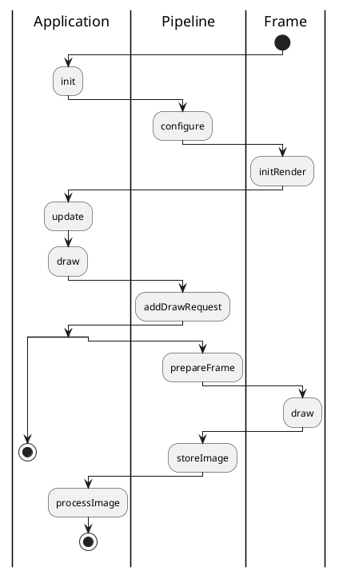

# ShadedPath12 Architecture (branch new_engine3)
DirectX 12 Framework and Applications for Oculus Rift

 

@startuml component
actor client
node app
database db

db -> app
app -> client
@enduml

### Activity

